# Ejercicio 1

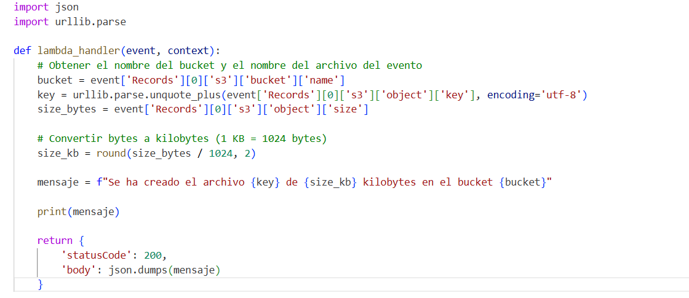

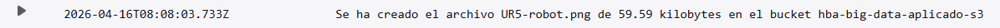

# Ejercicio 2

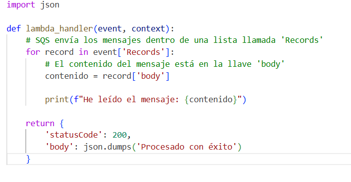


# Ejercicio 3

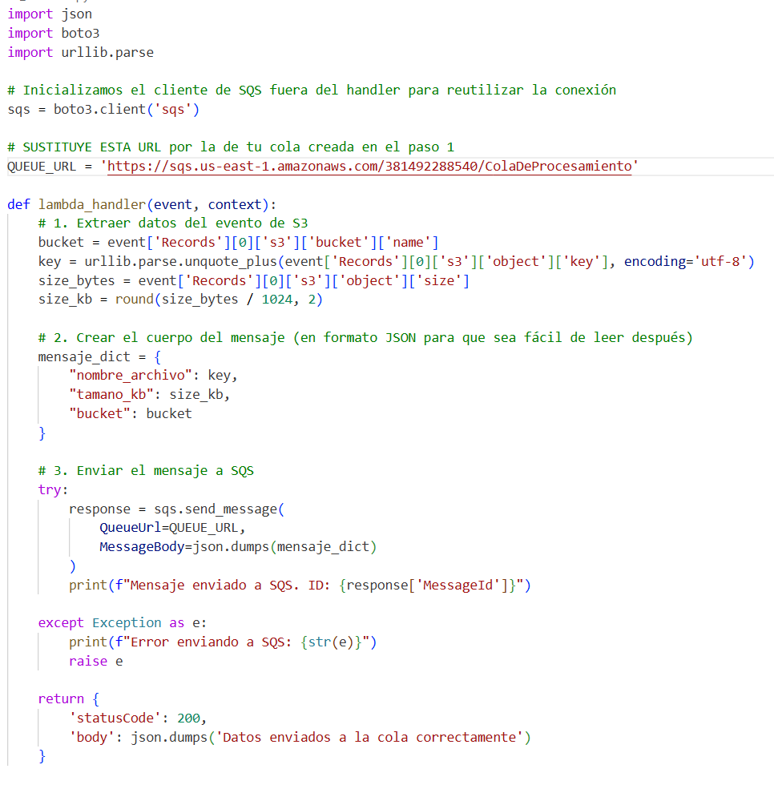

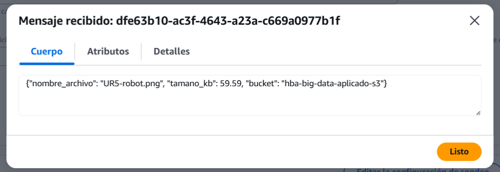

# Ejercicio 4

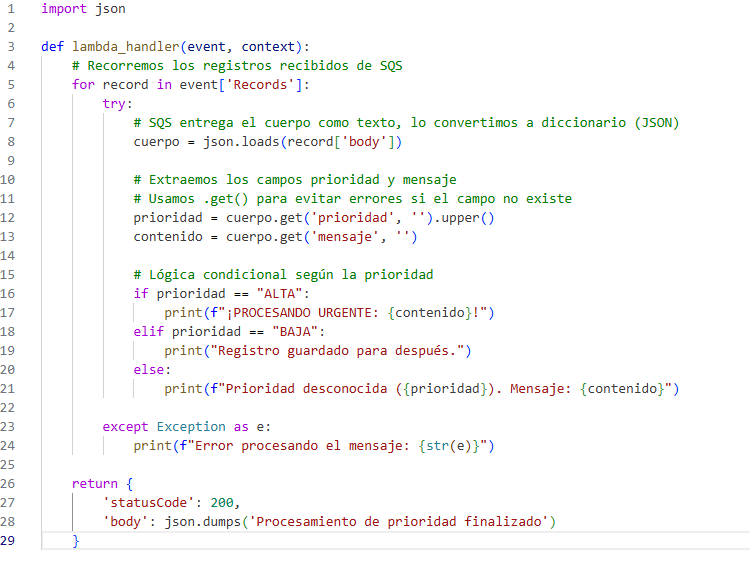

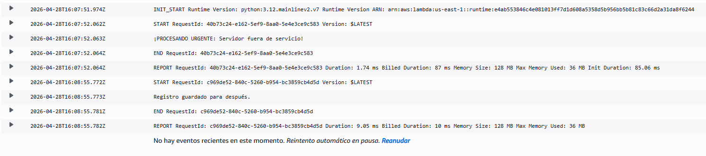

# Ejercicio 5


```python
import boto3
import json

# Creamos el cliente de SQS
sqs = boto3.client('sqs', region_name='us-east-1')

# Definimos la URL de la cola
queue_url = 'https://sqs.us-east-1.amazonaws.com/381492288540/ejercicio4'

# Creamos un diccionario (JSON) con los datos
datos_archivo = {
  "prioridad": "A",
  "mensaje": "Lo dejamos para mas tarde"
}

# Serializamos el diccionario
mensaje_serializado = json.dumps(datos_archivo)

# Enviamos el mensaje
response = sqs.send_message(
    QueueUrl=queue_url,
    MessageBody=mensaje_serializado
)
```

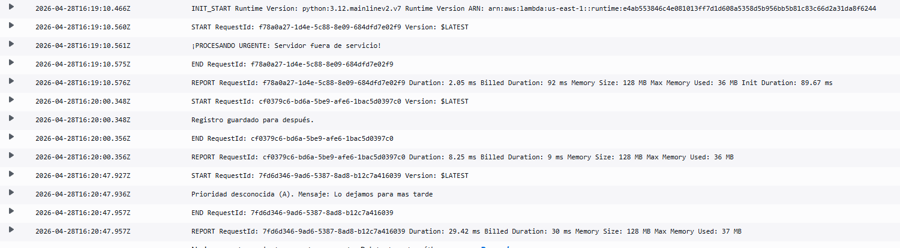

# Ejercicio 6

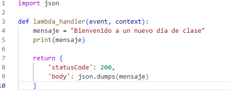

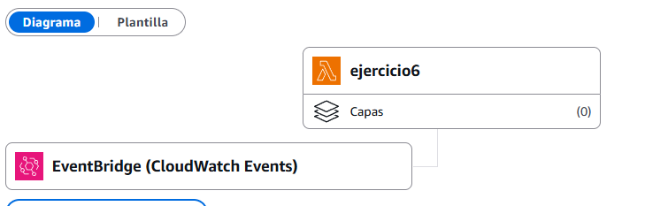

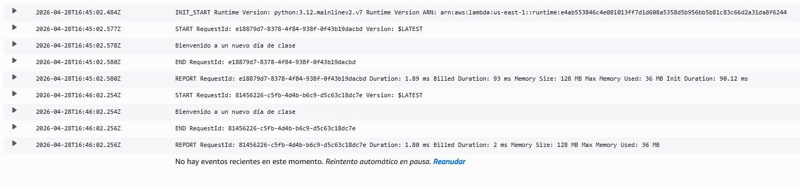

# Ejercicio 7

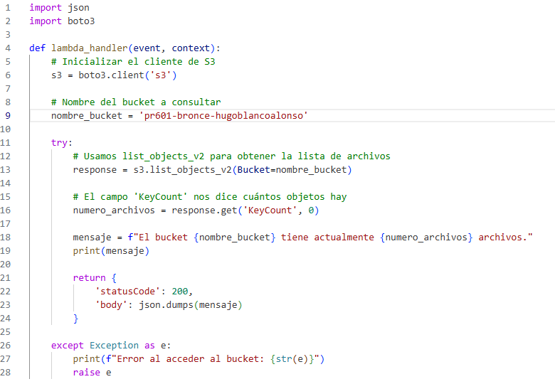

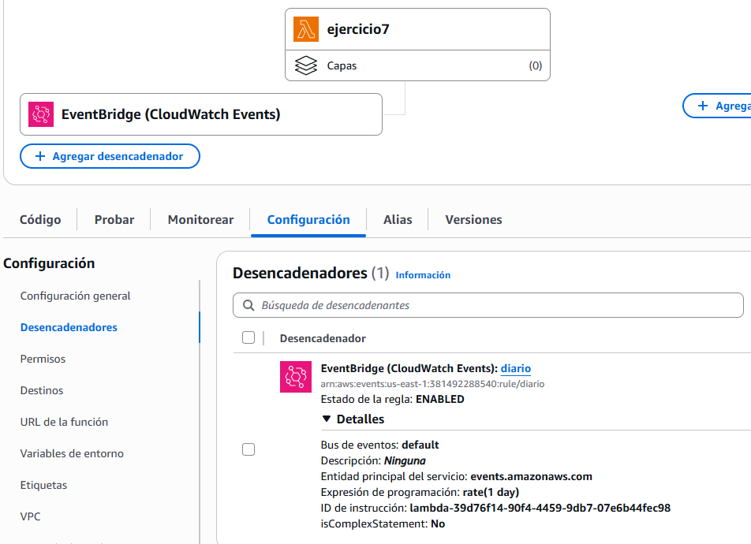

# Ejercicio 7

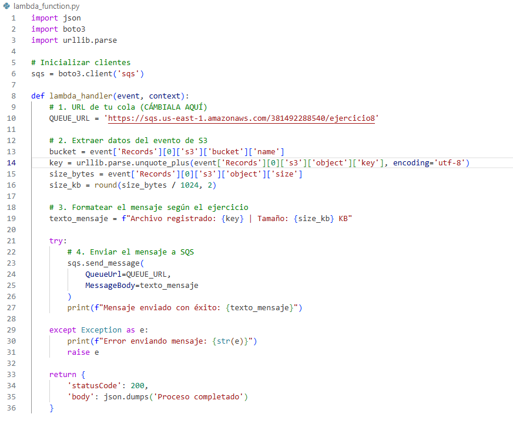

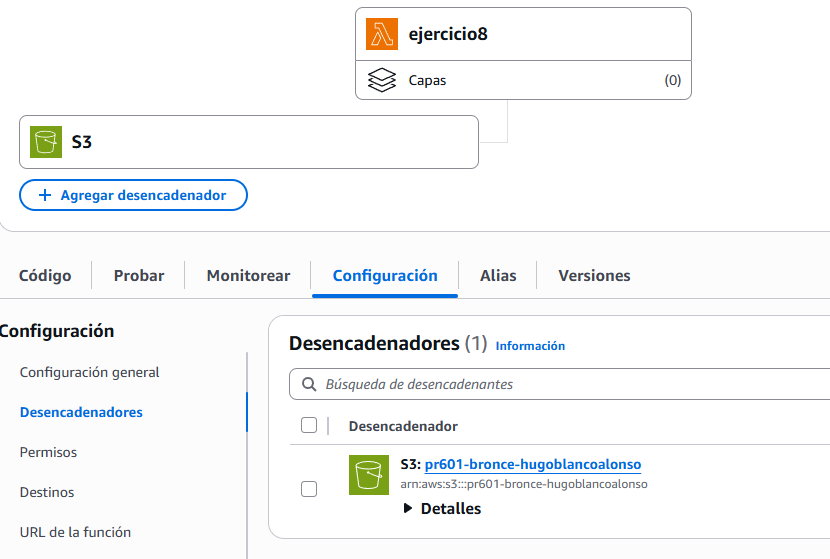

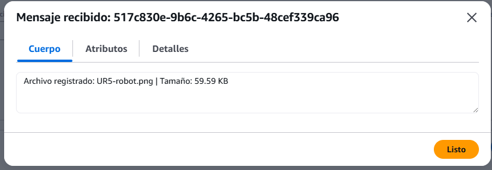
