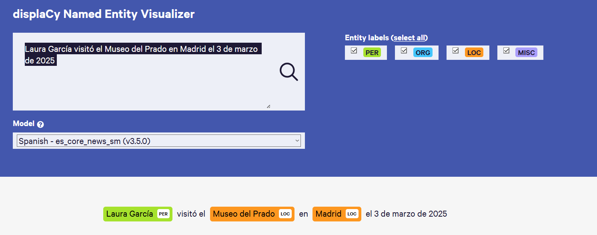
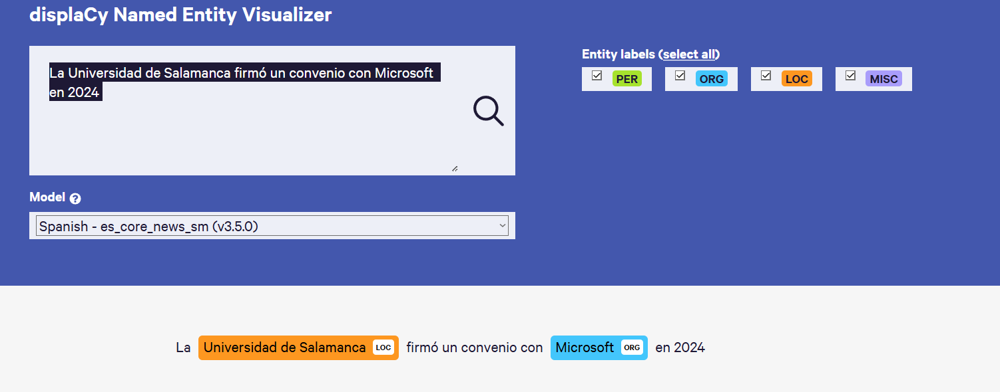
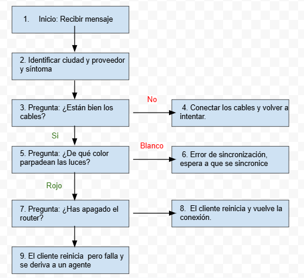

# 1. Tarea A - NER (Detector de identidades)

## A.1

### Imagen 1

### Imagen 2

## A.2

| Entidad Detectada | Etiqueta | ¿Correcto? | Comentario |
| ----------------- | -------- | ---------- | ---------- |
| Laura García | Per | Si | Detectó el nombre completo de la persona |
| Museo del Prado |  Loc | Si | Detectó la localización |
| Madrid | Loc | Si | Detectó la localización |
| Universidad de Salamanca | Loc | Si | Detectó la localización |
| Microsoft | Org | Si | Detectó la oranización |
| Zara | Loc | No | Debería de dentificarlo como Org, puede que lo haya identificado com ouna ciudad |
| me llegó | Loc | No | No debería haberlo identificado como nada, igual se esperaba una direccion despues de ese conjunto de palabras |
| Segovia | Loc | Si | Detectó la localización |
| Mayor | Loc | No | Esta vien pero deberia haber identificado "calle Mayor" al completo, mayor solo no significa nada |

# 2. Tarea B - Ambiüedad del lenguaje

## Respuesta 1

Frase 1:  Usted aqui no pinta nada

Interpretación A: La persona no tiene importacia en ese lugar.

Interpretación B: La persona no esta realizando el trabajo de pintar.

Tipo de confusión: Léxica-morfológica

Justificación: La palabra pintar se puede entender en sentido literal o figurado.

## Respuesta 2

Frase 2:  Pedro quiere pelearse con un italiano.

Interpretación A: Pedro quiere pegar a un italiano en concreto.

Interpretación B: Pedro pegaría a cualquier italiano que se encuentre.

Tipo de confusión: Semantica.

Justificación: El artículo "un" genera la duda si se refiera a uno en concreto o no.

# 3. Tarea C - Diseño de min-Chatbot de soporte

### Diagrama de Flujo

### Riesgos:

- Si el bot no detecta alguna de las entidades entraria en bucle.
- Si el ocurre alguna escena que no esta contemplada por el bot tambien se quedaría pillado.

Para resolverlo:

- Se podría implementar una confirmación, es decir que si o si tengas que dar esos datos necesarios
- Tambien se podría implementar que tras varios intentos fallidos te contactara directamente con un operador.
