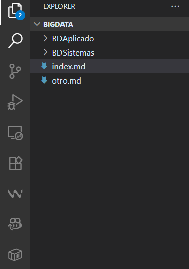

# Titulo prier nivel
## Titulo segundo nivel
### Titulo tercer nivel

Esto es un parrafo normal

Diferente parrafo

Podemos poner **negrita** y *cursiva*

La funcion `print()` de Python

```python
print("Hola Mundo1")
```
Puedo poner lstas:

- Primer elemento
- Segundo elemento
  - segundo nivel
    - tercer nivel
1. elemento
2. elemento
   1. elemnto 


[Texto del enlace](https://google.com)

[A otro fichero](./otro.md)

